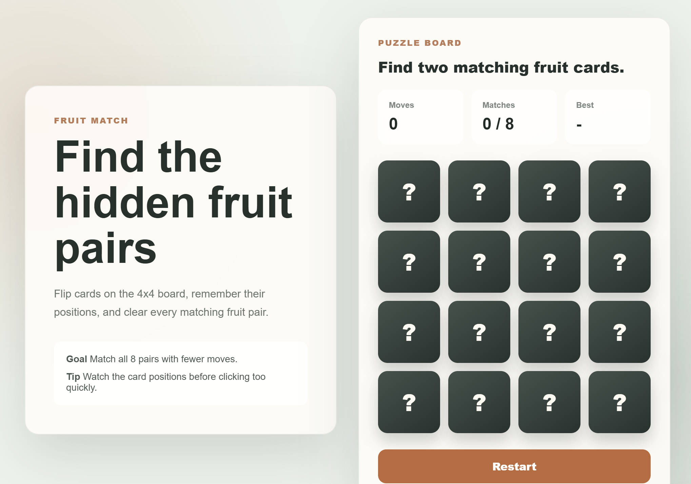

# puzzle-app

## 카드 데이터는 어떻게 만들어질까?

이 퍼즐게임은 같은 과일 카드 2장을 찾는 게임입니다.

게임이 시작되면 컴퓨터는 먼저 카드 데이터를 만듭니다. 카드 데이터는 쉽게 말해
"카드 한 장이 어떤 과일인지, 어떤 그림을 보여줄지, 지금 뒤집혀 있는지"를 적어 둔
정보입니다.

## 1. 과일 8개를 준비합니다

카드의 기본 재료는 `js/utils.js` 파일의 `FRUITS`에 들어 있습니다.

예를 들면 이런 정보가 있습니다.

```js
{ name: "Apple", color: "#ef4444" }
```

이 뜻은 다음과 같습니다.

- `name`: 과일 이름입니다.
- `color`: 과일 그림에 사용할 색깔입니다.

현재 게임에는 과일 8개가 있습니다.

- Apple
- Orange
- Lemon
- Lime
- Berry
- Grape
- Peach
- Melon

## 2. 같은 과일을 한 번 더 복사합니다

퍼즐게임은 같은 카드 2장을 찾아야 합니다.

그래서 과일 8개를 그대로 한 번 더 복사해서 총 16장의 카드를 만듭니다.

쉽게 말하면 이렇게 됩니다.

```txt
사과, 오렌지, 레몬, 라임, 베리, 포도, 복숭아, 멜론
사과, 오렌지, 레몬, 라임, 베리, 포도, 복숭아, 멜론
```

## 3. 카드를 섞습니다

복사한 카드 16장은 `shuffle()` 함수로 섞입니다.

이건 책상 위에 카드 16장을 뒤집어 놓고 손으로 마구 섞는 것과 비슷합니다.
그래서 게임을 새로 시작할 때마다 카드 위치가 달라집니다.

## 4. 과일을 진짜 카드 데이터로 바꿉니다

`createCards()` 함수는 섞인 과일들을 하나씩 카드 데이터로 바꿉니다.

카드 하나는 대략 이렇게 생겼습니다.

```js
{
  id: "0",
  name: "Apple",
  image: "사과 그림",
  flipped: false,
  matched: false
}
```

각 값의 뜻은 다음과 같습니다.

- `id`: 카드의 번호입니다.
- `name`: 과일 이름입니다.
- `image`: 카드에 보여줄 과일 그림입니다.
- `flipped`: 카드가 지금 뒤집혀 있는지 알려줍니다.
- `matched`: 이미 짝을 찾은 카드인지 알려줍니다.

처음에는 카드가 모두 뒤집혀 있지 않기 때문에 `flipped`는 `false`입니다.
아직 짝도 찾지 못했기 때문에 `matched`도 `false`입니다.

## 5. 만든 카드를 게임 상자에 넣습니다

`js/game.js` 파일에서 게임을 시작할 때 이런 일이 일어납니다.

```js
state.cards = createFruitCards();
```

쉽게 말하면 다음과 같습니다.

```txt
새 게임 시작!
카드 16장 만들어!
그 카드를 게임 상자(state.cards)에 넣어!
```

`state.cards`는 현재 게임에서 사용하는 카드 목록입니다.

## 6. 화면에 카드를 보여줍니다

`js/board.js` 파일은 `state.cards`에 들어 있는 카드 데이터를 보고 화면에 카드를
하나씩 그립니다.

카드가 뒤집혀 있으면 과일 그림을 보여주고, 이미 짝을 찾은 카드라면 다시 누르지
못하게 만듭니다.

## 전체 흐름 정리

카드 데이터가 만들어지는 순서는 다음과 같습니다.

```txt
과일 8개 준비
-> 똑같이 한 번 더 복사해서 16장 만들기
-> 카드 위치 섞기
-> 각 카드에 번호, 이름, 그림, 상태 붙이기
-> state.cards에 저장
-> board.js가 화면에 카드로 보여주기
```

한마디로 말하면, 카드 데이터는 "과일 목록을 두 벌로 복사해서 섞은 다음, 각 과일에
카드 번호와 상태를 붙여 만든 것"입니다.
# 실행화면
